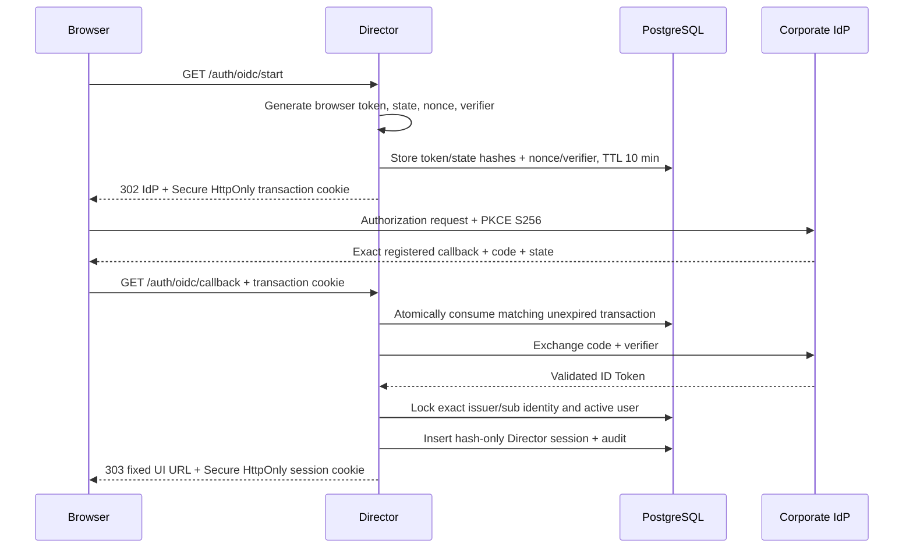

# OIDC/SSO boundary v1

Статус: архитектурный черновик v1 и исполнимый reference-срез с
fail-closed discovery conformance.

Документ определяет production boundary корпоративного входа в «Дирижёр».
Он дополняет [Auth/RBAC v1](auth-rbac-v1.md): OIDC подтверждает внешнюю
идентичность, но не передаёт провайдеру управление Director-сессиями, ролями
или доступом к проектам.

## 1. Архитектурное решение

1. Director является confidential OIDC Relying Party.
2. Используется Authorization Code Flow с PKCE `S256`, уникальными `state` и
   `nonce` для каждой попытки. Алгоритм подписи ID Token явно закрепляется
   конфигурацией и допускается только из асимметричного allowlist.
3. IdP token проверяется только на callback boundary. Business endpoints не
   принимают access token IdP и не вызывают IdP на каждом запросе.
4. После успешного callback Director выпускает собственную opaque session.
   В PostgreSQL хранится только `sha256:<hex>` этой session.
5. Identity сопоставляется только по точной паре `(issuer, ID Token sub)` и
   ожидаемому локальному provider code. Email, display name и неподтверждённые
   claims не используются для автоматической привязки.
6. В v1 разрешены только заранее provisioned identities. Неизвестный `sub`
   получает `identity_not_provisioned`; JIT user creation выключен.
7. OIDC access token, refresh token и raw ID Token не сохраняются в Director.
8. Startup получает metadata только discovery-вызовом по configured issuer и
   останавливается при несовместимом security profile.

## 2. Поток входа



Callback URL строится из server-configured `DIRECTOR_OIDC_REDIRECT_URI`, а не
из недоверенного `Host` или forwarded-заголовка запроса. Post-login URL также
фиксирован конфигурацией и обязан иметь тот же HTTPS origin. Параметр
пользовательского `return_to` отсутствует, поэтому open redirect не создаётся.

## 3. Одноразовая login-транзакция

`oidc_login_transactions` хранит:

- hash случайного browser token из `__Host-dirizhor_oidc`;
- hash `state`;
- `nonce` и PKCE `code_verifier`, нужные для callback;
- provider, request ID, IP, время создания и истечения;
- время потребления.

Browser token и `state` имеют 256 бит энтропии и в сыром виде в БД не
сохраняются. Транзакция действует 10 минут по умолчанию и не более 15 минут.
При первом допустимом callback строка блокируется, помечается consumed, а
`nonce` и `code_verifier` зануляются до обращения к IdP. Повтор callback не
может выпустить вторую session. Временный сбой после consume требует начать
новую попытку входа; это осознанный fail-closed выбор.

Expired строки и consumed строки старше 24 часов очищаются при создании новой
login-транзакции. Для production-нагрузки позднее нужен отдельный scheduled
cleanup, не зависящий от новых входов.

## 4. Director session и браузер

Успешный callback устанавливает:

```text
__Host-dirizhor_session=<opaque 256-bit value>;
Path=/; Secure; HttpOnly; SameSite=Lax
```

Префикс `__Host-` исключает `Domain` и требует `Path=/` и `Secure`. JavaScript
UI не читает cookie и не получает token через query/fragment/postMessage.
Director по-прежнему принимает `Authorization: Bearer` для non-browser clients;
если одновременно присутствуют header и cookie, header имеет приоритет.

Cookie-authenticated mutation дополнительно требует точного HTTPS
same-origin `Origin`. Все public mutations также требуют `X-Request-Id`, который
не является CORS-safelisted header; CORS для сторонних origins не включается.
Safe `GET` не меняет бизнес-состояние, кроме технического `last_seen_at`.

Любой logout отзывает серверную строку session и очищает cookie. Отзыв начинает
действовать на следующем запросе; ожидание истечения cookie не требуется.

OIDC-specific `POST /api/v1/auth/oidc/logout` сначала выполняет этот локальный
отзыв, а затем возвращает проверенный `end_session_endpoint` как `logout_url`.
UI сам выполняет top-level navigation. Если endpoint не объявлен, значение
равно `null`, но локальный logout уже завершён. Raw ID Token не хранится, поэтому
`id_token_hint` не передаётся и IdP вправе запросить подтверждение выхода.

## 5. Identity provisioning

До первого входа административный provisioning-процесс создаёт:

```text
app_users(id, status='active', ...)
user_identities(user_id, provider_code, provider_issuer=issuer, provider_subject=sub)
```

`provider_code` является локальным стабильным именем provider,
`provider_issuer` — точным configured issuer, а `provider_subject` равен `sub`
из проверенного ID Token без нормализации. SQL uniqueness по `(issuer, sub)` и
runtime-проверка issuer не позволяют случайно переклеить identity при смене IdP
под тем же provider code.
Связывать identity по email запрещено: email может измениться, быть повторно
выдан или иметь отличающуюся семантику у разных issuer.

Reference-команда `oidc:provision` выполняет create/attach атомарно, принимает
`sub` только через stdin, требует явные стабильные UUID и создаёт
`identity.provisioned` без raw subject в audit metadata. Повтор точной команды
идемпотентен, а конфликт или вторая identity того же provider отклоняется.

Команда `oidc:revoke-access` атомарно переводит пользователя в `disabled`,
отзывает все Director sessions и создаёт `user.access_revoked`. Обе команды
используют отдельный краткоживущий provisioning database credential. Полный
порядок описан в [operational runbook](oidc-operations-runbook.md).
Удаление пользователя и автоматический unlink не входят в v1.

## 6. Проверка ответа IdP

OIDC adapter выполняет discovery по issuer и делегирует стандартной библиотеке:

- точную проверку issuer и audience/client ID;
- подпись и допустимость ID Token;
- `state` и `nonce` equality;
- Authorization Code exchange с исходным PKCE verifier;
- обработку authorization/token endpoint ошибок.

Director требует claim `sub`. Claims `email`, `name`, groups и roles не
переносятся в RBAC. Роли и project assignments остаются только в Director.

До создания adapter Director дополнительно проверяет metadata:

- exact `issuer` и HTTPS authorization/token/JWKS endpoints;
- поддержку `code`, PKCE `S256` и выбранного token auth method;
- поддержку закреплённого асимметричного ID Token algorithm;
- `public` или `pairwise` subject type;
- HTTPS `end_session_endpoint`, если настроен post-logout redirect.

Отсутствующая реклама optional scopes/claims является warning: discovery
спецификация допускает неполное объявление scopes. Runtime-проверка ID Token,
включая issuer, audience/client ID, signature, expiry и nonce, остаётся
обязательной независимо от metadata report.

## 7. Ошибки и audit

Обработанный результат authentication flow возвращается на fixed UI URL с одним
безопасным кодом (непредвиденная runtime/DB ошибка остаётся generic `500`):

- `oidc_transaction_invalid`;
- `oidc_authentication_failed`;
- `oidc_provider_unavailable`;
- `identity_not_provisioned`.

Raw provider error, authorization code, token и subject в URL не попадают.
Успех создаёт `authentication.succeeded`. Provider rejection/unavailability и
проверенный, но не provisioned subject создают обезличенный
`authentication.failed`; для проверенного subject audit хранит только его
SHA-256 hash. Отсутствующая, поддельная или повторно использованная
login-транзакция отклоняется без постоянной записи в БД, чтобы публичный
callback нельзя было использовать для раздувания audit. Такие отказы должны
попадать в ограниченную по частоте operational telemetry на ingress/runtime.
Password, token, authorization code, code verifier, nonce и provider response в
audit не копируются.

## 8. Runtime configuration

OIDC доступен только в protected HTTPS mode и требует:

- `DIRECTOR_OIDC_ISSUER_URL`;
- `DIRECTOR_OIDC_CLIENT_ID`;
- `DIRECTOR_OIDC_CLIENT_SECRET`;
- `DIRECTOR_OIDC_REDIRECT_URI` с точным путём
  `/api/v1/auth/oidc/callback`;
- `DIRECTOR_OIDC_POST_LOGIN_REDIRECT_URI` на том же origin.

Алгоритм ID Token задаёт `DIRECTOR_OIDC_ID_TOKEN_SIGNING_ALG` (`RS256` по
умолчанию). Optional `DIRECTOR_OIDC_POST_LOGOUT_REDIRECT_URI` обязан иметь тот
же origin; если он задан, provider обязан объявить `end_session_endpoint`.

Дополнительно настраиваются provider code, scopes с обязательным `openid`,
`client_secret_basic`/`client_secret_post`, discovery timeout и TTL
login-транзакции. HTTP issuer/callback, URL credentials, query/fragment и
cross-origin post-login redirect отклоняются при старте.

В production client secret может читаться из mounted file через
`DIRECTOR_OIDC_CLIENT_SECRET_FILE`; одновременно задавать прямое значение и
`_FILE` запрещено.

В IdP регистрируется ровно значение `DIRECTOR_OIDC_REDIRECT_URI`. Endpoint
Director должен быть доступен браузеру и IdP через тот же внешний HTTPS origin;
TLS termination/reverse proxy обязан сохранять валидный `Host` и не разрешать
произвольные host headers.

Перед rollout выполняется `pnpm oidc:preflight` в production network/secret
environment. Conformance error блокирует запуск; автоматического insecure
fallback нет.

## 9. Не входит в v1

- SAML;
- несколько одновременно настроенных OIDC providers;
- JIT provisioning и linking/unlinking API;
- импорт IdP groups в Director roles;
- refresh token и вызов UserInfo;
- back-channel и front-channel logout IdP;
- MFA policy внутри Director: её применяет корпоративный IdP;
- distributed rate limit и отдельный scheduled cleanup;
- client authentication через `private_key_jwt` или mTLS.

## 10. Проверяемые инварианты

- raw browser token, state и Director session token отсутствуют в БД;
- `nonce` и verifier зануляются после consume;
- callback replay не создаёт вторую session;
- неизвестный subject не создаёт пользователя;
- subject не появляется в audit в открытом виде;
- cookie имеет `Secure`, `HttpOnly`, `SameSite=Lax`, `Path=/`;
- cookie mutation без same-origin `Origin` получает `403`;
- revoked session получает `401` на следующем запросе;
- OIDC logout отзывает local session до выдачи IdP URL;
- disable/revoke-all коммитится одной транзакцией и сохраняет identity row;
- UI работает с cookie, не читая token из JavaScript.

## Нормативные основания

- [OpenID Connect Core 1.0](https://openid.net/specs/openid-connect-core-1_0.html);
- [OpenID Connect Discovery 1.0](https://openid.net/specs/openid-connect-discovery-1_0.html);
- [OpenID Connect RP-Initiated Logout 1.0](https://openid.net/specs/openid-connect-rpinitiated-1_0.html);
- [OAuth 2.0 Security Best Current Practice, RFC 9700](https://www.rfc-editor.org/rfc/rfc9700.html);
- [openid-client: Authorization Code/OIDC client](https://github.com/panva/openid-client).
